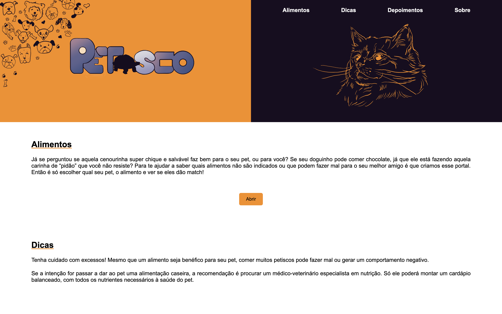

# Projeto Integrador

## Visão Geral
O Projeto Integrador "Petisco" é uma aplicação web/app desenvolvida como parte do projeto integrador. Ela permite que qualquer pessoa possa confirmar se seu animal de estimação pode comer ou não determinado alimento. Um lugar onde a informação é confiável e que vai estar disponível a qualquer momento e em qualquer lugar.

  

## Funcionalidades Principais
 
O aplicativo é intuitivo e de fácil utilização, com uma interface amigável e acessível para todos os usuários. Os donos de pets poderão acessar o aplicativo, que conterá informações detalhadas sobre uma ampla variedade de alimentos comumente disponíveis. É possível pesquisar por tipo de animal como cães, gatos, aves, roedores, entre outros, e encontrar recomendações específicas sobre quais alimentos são adequados, nutritivos e seguros para cada espécie. Além disso, o aplicativo também destaca os alimentos que devem ser evitados, devido a possíveis riscos à saúde do animal.

## Pré-requisitos
- Dispositivo desktop ou mobile com conexão a internet .

## Como Instalar
- Não é necessário a instalação do sistema, somente sendo necessário o navegador de sua preferência.

## Como Executar
Para ter acesso ao aplicativo bastar digitar "https://pi-grupo13.netlify.app" em um navegador de internet de sua preferencia. Logo ira abrir a pagina incial do site, la se encontram diversas informações e atalhos no canto superior direito para ir diretamente para o assunto que você deseja. Clicando em "Alimentos" e depois em "Abrir" você será direcionado para a parte do site onde deve-se escolher qual animal você desaja pesquisar. Após escolher o animal irá abrir uma página onde estarão as informações nescessarias sobre aquele animal. Ao clicar em "Dicas" você será direcionado para uma parte onde serão mostradas dicas extras sobre a alimentação de seu animal de estimação. Clicando em "Depoimentos" você será direcionado para a parte onde pessoas que já utilizaram o site contam sua experiencia com o mesmo. E por ultimo clicando em "Sobre" você irá ser direcionado para a parte onde explicamos um pouco sobre o projeto e nossas motivações para cria-lo.

## Vídeo de Demonstração

https://github.com/Grupo-13-Senac/PROJETO-INTEGRADOR-4-Semestre-Grupo13/assets/83326082/a6a11a5f-43a8-4514-a2ea-117d272e6a7c

https://youtu.be/6PfF59S42U4

## Integrantes do Grupo
- Alana Matos de Oliveira
- Breno Roriz Pitanga
- Bruno Torres Delfino
- Daiara Vieira Barbosa
- Edison de Souza Garcia
- Eduardo Rigonatto do Carmo
- Kamila dos Santos Silva Tenorio
- Lucas da Costa Bustamante

